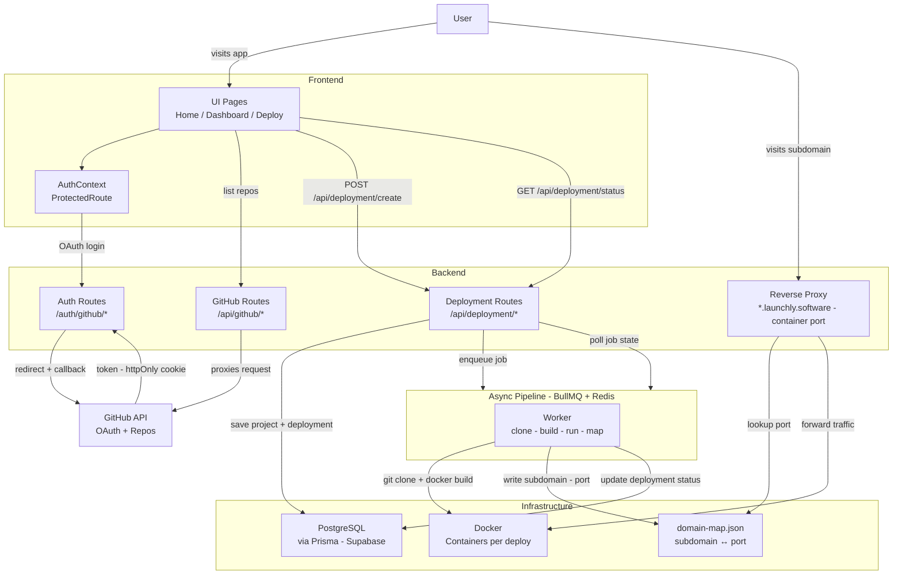

# Launchly

**Self-hosted PaaS - deploy apps from GitHub with one click.**

Launchly is a lightweight deployment engine inspired by Vercel and Railway. It authenticates via GitHub OAuth, builds Docker images from framework-specific templates, and routes traffic through a reverse proxy - all driven by an async job queue.


## Tech Stack

| Layer      | Technology                                |
| ---------- | ----------------------------------------- |
| Runtime    | Bun + TypeScript                          |
| Backend    | Express                                   |
| Frontend   | React, Vite, Tailwind CSS                 |
| Database   | PostgreSQL via Prisma (Supabase)          |
| Queue      | BullMQ + Redis                            |
| Auth       | GitHub OAuth (httpOnly cookies)           |
| Proxy      | `http-proxy` - wildcard subdomain routing |
| Containers | Docker                                    |


## System Design



## How Deployments Work

When you trigger a deploy, the BullMQ worker runs these steps in order:

1. **Clone** - pulls your GitHub repo into a temp directory
2. **Dockerfile** - injects your build/start commands into a framework template
3. **Build** - runs `docker build`
4. **Run** - finds a free port, starts the container
5. **Map** - writes `subdomain.domain - port` to `domain-map.json`
6. **Cleanup** - removes the cloned source (container keeps running)

Your app is then live at `{subdomain}.{ROOT_DOMAIN}`.


## API Reference

### Auth

| Method | Endpoint                | Description                  |
| ------ | ----------------------- | ---------------------------- |
| GET    | `/auth/github/login`    | Redirect to GitHub OAuth     |
| GET    | `/auth/github/callback` | OAuth callback, sets session |
| POST   | `/auth/logout`          | Clears auth cookie           |

### GitHub

| Method | Endpoint            | Description              |
| ------ | ------------------- | ------------------------ |
| GET    | `/api/github/user`  | Current GitHub user info |
| GET    | `/api/github/repos` | List user's repositories |

### Deployments

| Method | Endpoint                         | Description                         |
| ------ | -------------------------------- | ----------------------------------- |
| POST   | `/api/deployment/create`         | Queue a deployment, returns `jobId` |
| GET    | `/api/deployment/status?jobId=X` | Poll job progress and result        |

**Example deployment payload:**

```json
{
    "repoUrl": "https://github.com/user/repo",
    "framework": "vite",
    "subDomain": "my-project",
    "buildCommand": "npm run build",
    "startCommand": "npx serve dist",
    "rootDirectory": ""
}
```

## Supported Frameworks

| Framework | Base Image        | Exposed Port |
| --------- | ----------------- | ------------ |
| Express   | `node:18-alpine`  | 3000         |
| Next.js   | `node:18-alpine`  | 3000         |
| React     | `node:18-alpine`  | 3000         |
| Vite      | `node:18-alpine`  | 3000         |
| Python    | `python:3.9-slim` | 3000         |

Each template supports custom `BUILD_COMMAND` and `START_COMMAND` build args.

## License

MIT
